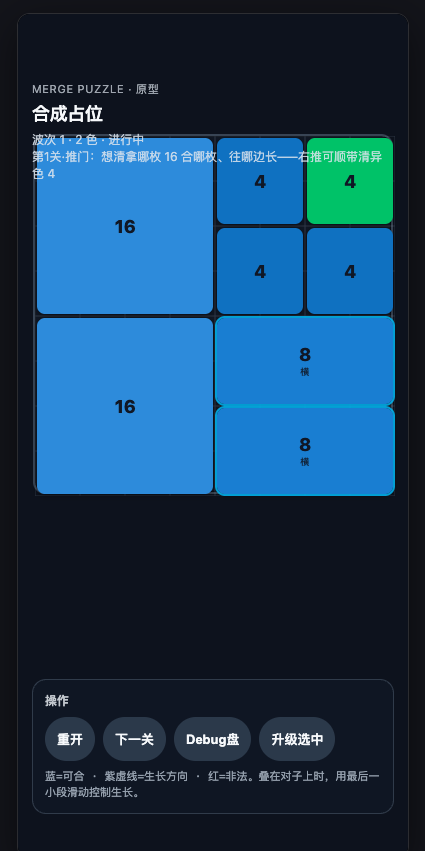

# 美术画面设计 — Merge Puzzle（v3.2 配色锁定）

| 元数据 | 内容 |
|--------|------|
| 状态 | **配色已锁 · 材质=光滑软塑料（非粘土）· 待代码换皮** |
| 方向名 | **Soft Plastic Pastels · 软塑料粉彩** |
| 配色真源 | 用户选定参考 `docs/art/locked-palette/00-ref-color-liked-*.jpg`（**只要色，不要粘土感**） |
| 材质真源 | `docs/art/locked-palette/01–04` 光滑/磨砂塑料 |
| 布局真源 | 当前原型：顶栏 / 中盘 / 底操作 |
| 规则 | [GAME_RULES.md](./GAME_RULES.md) |
| 舞台 | **390×844** · UI 仅 `#ui-root` |

### 已锁定决策

| 维 | 决定 |
|----|------|
| 配色 | 粉彩五色：珊瑚 / 薄荷 / 黄油 / 丁香 / 天蓝 + 薄荷格托盘 + 浅紫白顶 |
| 材质 | **光滑软塑料 / 雾面硅胶砖** — **禁止粘土/橡皮泥起伏** |
| 块信息 | 默认 **无数字、无图标**；体积靠面积 |
| 层级 | 块为主体：侧厚 + 接触影 + 轻 rim；舞台淡 |
| 不做 | 粘土裂纹、指纹、糖膜、强主题贴纸 |

### 锁定色板（生产 token 草案）

| Token | 角色 | Hex 草案 |
|-------|------|----------|
| `--piece-0` | Coral 珊瑚（略鲜） | `#FF8B7A` |
| `--piece-1` | Mint 薄荷 | `#5ED9B0` |
| `--piece-2` | Sky 天蓝 | `#5AAEFF` |
| `--piece-3` | Butter 黄油 | `#FFD54A` |
| `--piece-4` | Lilac 丁香 | `#B794F6` |
| `--tray` | **白棋盘**（可极淡内格） | `#FFFFFF` / `#F7F8FC` |
| `--stage` | **蓝背景 · 无格子** | `#A8D4F5` → `#8EC4F0`（纯色/微渐变） |
| `--ink` | 字 | `#6B6578` |

> 2026-03 迭代：用户指定「棋盘白 + 背景蓝 + 背景无格」。参考 `docs/art/locked-palette/06-white-board-blue-bg.jpg`。

**塑料块 CSS 特征（非粘土）**

```css
/* 均匀曲面、干净边缘 — 不要噪点/起伏贴图 */
background: linear-gradient(165deg, tint 0%, base 50%, shade 100%);
box-shadow:
  inset 0 2px 3px rgba(255,255,255,.45),
  inset 0 -2px 4px rgba(0,0,0,.05),
  0 5px 12px rgba(60,80,90,.12);
border-radius: 14px;
/* 禁止：noise texture、不规则边缘、粘土凹凸 */
```

---

## 0. 设计图

| 图 | 说明 |
|----|------|
| [locked-palette/](./art/locked-palette/) | **配色锁 + 去粘土 → 塑料** |
|  | **现网布局**（结构保留） |
| 历史探索 | `art/variants-*`（过程稿） |

---

## 1. 设计原则（一句话）

**布局不动、只换皮肤：磨砂软积木块 + 浅色干净壳，反馈用 Style Bible 四态。**

| 锁定 | 可换 |
|------|------|
| 顶栏三行信息结构 | 深色 → 浅色字色/底 |
| 居中 ~360 棋盘 | 深 slate 盘 → 浅托盘 |
| 底栏「操作」卡片 + 圆角按钮 | 深玻璃 → 浅卡片 |
| 块 = 色+体积矩形 + 数字 | HSL 蓝绿 → 五色磨砂漆 |
| 蓝可合 / 紫 T\* / 红非法 | 对齐 Bible：VALID / PREVIEW / INVALID |

**不做**：糖果主题、金星徽章重构、大改信息架构、新增大厅/角色。

---

## 2. 正式布局结构（来自现截图，须遵守）

```
#stage 390×844
├── #board-root          绝对定位 · 居中 360² · originY≈120
│     grid / pieces / proposal / T* / target ring
└── #ui-root             flex  column · space-between · safe padding
      ├── header         顶：eyebrow + 标题 + status（多行）
      └── .panel         底：操作标题 + 按钮行 + hint
```

| 区 | 现内容（逻辑保留） | v3.1 视觉 |
|----|-------------------|-----------|
| **Header eyebrow** | `MERGE PUZZLE · 原型` | 小 caps / 11px · 色 `--ink-muted` · 可改文案为产品名，**层级不变** |
| **Header title** | `合成占位` | 18px Bold · `--ink`；正式名后可换字，**位置不变** |
| **Header status** | 波次 + 关卡旁白（多行 pre-wrap） | 12–13px · `--ink-muted` · 行高 1.4 · **不收成单行徽章**（信息量需要） |
| **Board** | 满盘块 + 数字 + 横/竖标记 | 磨砂块 + 浅托盘 + 弱格线 |
| **Panel** | 标题「操作」+ 四按钮 + 底注 | 浅卡片 · 主按钮实心 Teal · 次按钮浅灰描边 |
| **Buttons** | 重开 / 下一关 / Debug盘 / 升级选中 | 圆角胶囊 · min-height 44 · Debug 正式可藏，布局槽位可留 |

棋盘几何（代码已有，勿为美术改玩法坐标）：

- `size = 360`，`cell = 45`，水平居中，`originY ≈ 120`

---

## 3. 材质与块（Style Bible → 生产规格）

### 3.1 材质关键词

```
matte toy blocks · frosted rubber · soft diffuse light
NO heavy gloss · NO candy sheen · NO sugar particles
```

### 3.2 五色阵营（对齐 Bible 标注）

| color | 名 | Fill | 深沿 / 字色底 | 备注 |
|------:|----|------|---------------|------|
| 0 | Coral | `#F07B6E` | `#C85A50` | 可作暖主色 |
| 1 | Teal | `#4DB8A8` | `#2F8F82` | 截图中「异色 4」应对此 |
| 2 | Blue | `#6B9FE0` | `#4578B8` | 现原型主蓝替换目标 |
| 3 | Amber | `#E8B84A` | `#C4922A` | |
| 4 | Violet | `#9B8AD4` | `#6F5FAF` | T\* 预览同色系 |

**体积**：同色不改色相；value 越大仅 **略加深沿影 / 字略实**，禁止 v2 那种糖浆高光升级。

### 3.3 块表面（DOM/CSS 可实现）

```css
.piece {
  border-radius: 12px; /* 单格；大块可 14–16 */
  background: linear-gradient(
    165deg,
    color-mix(in srgb, var(--fill) 92%, white) 0%,
    var(--fill) 48%,
    color-mix(in srgb, var(--fill) 88%, black) 100%
  );
  box-shadow:
    inset 0 1px 0 rgba(255, 255, 255, 0.35),
    inset 0 -1px 0 rgba(0, 0, 0, 0.06),
    0 4px 10px rgba(40, 45, 60, 0.12);
  color: rgba(255, 255, 255, 0.92);
  font-weight: 700;
  /* 数字：居中；横/竖轴标：小字半透明，可保留规则调试信息 */
}
```

- **禁止**：强镜面白条、彩虹描边、噪点糖粒  
- 轴标「横/竖」：opacity 0.55，不抢数字  

### 3.4 体积阶梯（Bible SIZE PROGRESSION）

规则仍是 `value` 占格；视觉上圆角与厚度随面积略增即可。合后形由玩法摆放决定，**不**为美术锁死外形表。

---

## 4. 反馈系统（Bible FEEDBACK → 现有三层预览）

| 规则层 | 现实现 | Bible | 视觉 token |
|--------|--------|-------|------------|
| 可合 | 蓝投影 / target ring | **VALID** 青环 + ✓ 感 | 环 `#5EC8FF` / fill `rgba(77,184,168,0.2)` |
| 原位 | 灰 | **CANCEL** | 灰环 `rgba(120,125,140,0.45)` 虚/淡 |
| 非法 | 红 | **INVALID** | 柔珊瑚描边 `rgba(240,123,110,0.55)` + 微抖 |
| 合后形 T\* | 紫虚线 | **PREVIEW** | 紫虚线 `#9B8AD4` + fill 10% |

拖合一体逻辑不改（`dropResolve` / `view`）；只换颜色与线型气质。

---

## 5. 壳与 HUD 色板

```css
:root {
  color-scheme: light;

  /* Stage */
  --stage-0: #e8ecf2;
  --stage-1: #dfe5ee;
  --shell-bg: #e8ecf2;

  /* Type */
  --ink: #2a2d36;
  --ink-muted: #6b7180;

  /* Board tray */
  --tray: #f4f1eb;
  --tray-border: rgba(60, 55, 50, 0.1);
  --grid-line: rgba(80, 85, 100, 0.1);

  /* Panel */
  --panel-bg: rgba(255, 255, 255, 0.88);
  --panel-border: rgba(60, 70, 90, 0.1);

  /* Buttons */
  --btn-bg: #eef1f6;
  --btn-ink: #2a2d36;
  --btn-primary-bg: #4db8a8;
  --btn-primary-ink: #fff;

  /* Feedback */
  --ok-ring: #5ec8ff;
  --bad-ring: rgba(240, 123, 110, 0.7);
  --merge-t: #9b8ad4;

  /* Pieces */
  --piece-0: #f07b6e;
  --piece-1: #4db8a8;
  --piece-2: #6b9fe0;
  --piece-3: #e8b84a;
  --piece-4: #9b8ad4;
}
```

| 组件 | 现（深色原型） | 目标 |
|------|----------------|------|
| `body` / `#stage` | `#0b1020` | 冷灰蓝渐变 `--stage-*` |
| `#board-root` | slate + 强边 | `--tray` + 软影 + 弱格线 |
| `header` 字 | 近白 | `--ink` / `--ink-muted` |
| `.panel` | 深玻璃 | 浅白卡片 + 轻 blur 可选 |
| `button` | `#334155` | 浅底深字；**重开**可用 primary teal |

---

## 6. 信息层级（正式感，不大改文案结构）

截图信息架构保留，仅调视觉权重：

```
eyebrow     最轻 · tracking 略开
title       主标题 · 一屏一个焦点字
status      关卡状态 + 课题旁白 · 可两行
board       视觉中心（最大权重）
panel       次要操作 · 不压盘
hint        最轻 · 操作说明可缩成一行图标化（P2）
```

建议正式文案（可后续改 copy，**布局行数可不变**）：

| 槽位 | 建议 |
|------|------|
| eyebrow | `MERGE PUZZLE` |
| title | 关卡名或产品名（如「推门」/ 游戏名） |
| status | 现 `waveIntro` + 波次信息 |
| panel-title | `操作` 或去掉标题只留按钮 |
| hint | 保留规则提示；Debug 说明仅 debug 模式 |

---

## 7. 动效（贴合现有，不另开主题）

现有已有：`easeOutBack`、spawn pop、push 滑动——**保留曲线，减弱「糖感」**。

| 事件 | 规格 |
|------|------|
| 抬起 | scale 1.04 + 影略深 |
| 可合环 | 透明度呼吸 1.5s 循环（可选） |
| 合并 | 短白闪一圈；**无星糖雨** |
| 补块 | 现有 `piece-spawn-pop` 幅度可略降 |
| 过关 64 | 柔光 0.6–1s，再清盘 |

---

## 8. 工程落点清单（P0）

| 文件 | 改什么 |
|------|--------|
| `style.css` | light token；header/panel/button；stage 背景 |
| `view.ts` | `boardRoot` 托盘样式；proposal / ring / T\* 色；去掉硬编码深色 |
| `shapes.ts` | `pieceFillColor` → 五色表 + 轻 gradient 或 CSS 变量 |
| `view.ts` paintPiece | 磨砂 shadow / radius / 数字对比度 |

**P1**：Debug 按钮 `?debug` 显隐；主按钮 primary 样式；格线 SVG 色。  
**不做（本轮）**：新增大厅、改 board 尺寸算法、改规则反馈语义。

---

## 9. 对照验收（截图级）

用第 1 关推门盘（双 16 + 4 群 + 异色 4 + 双 8）验收：

1. **布局**：顶文案 / 中盘 / 底操作 与现截图同一骨架。  
2. **块**：磨砂、五色可读；主色与 Teal 异色一眼可分。  
3. **壳**：浅色休闲，不是深色原型，也不是糖果包。  
4. **反馈**：拖合时 VALID / CANCEL / INVALID / PREVIEW 与 Bible 一致。  
5. **可读**：数字与 status 在浅底上对比足够（WCAG 大致 AA 目标）。

---

## 10. 版本记

| 版 | 结论 |
|----|------|
| v1 Calm Clay | 废 · 产品感 |
| v2 Soft Toy Pop | 废 · 过糖 |
| v3 Soft Block | 方向对，布局未锚 |
| **v3.1** | **Bible 材质 + 现布局结构** · 本文 |

---

**下一步**：按 §8 P0 直接改 `style.css` / `view.ts` / `shapes.ts` 换皮。需要的话说一声即开工。
